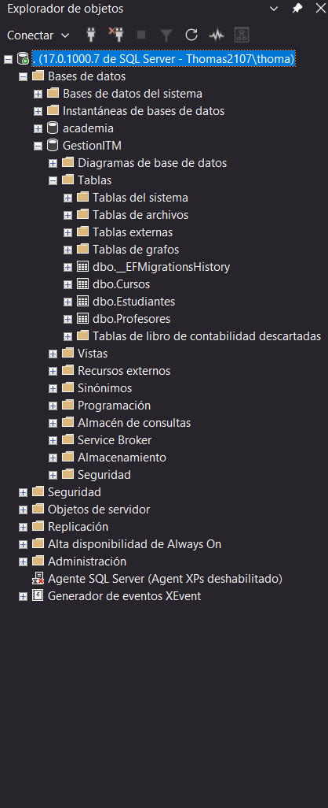
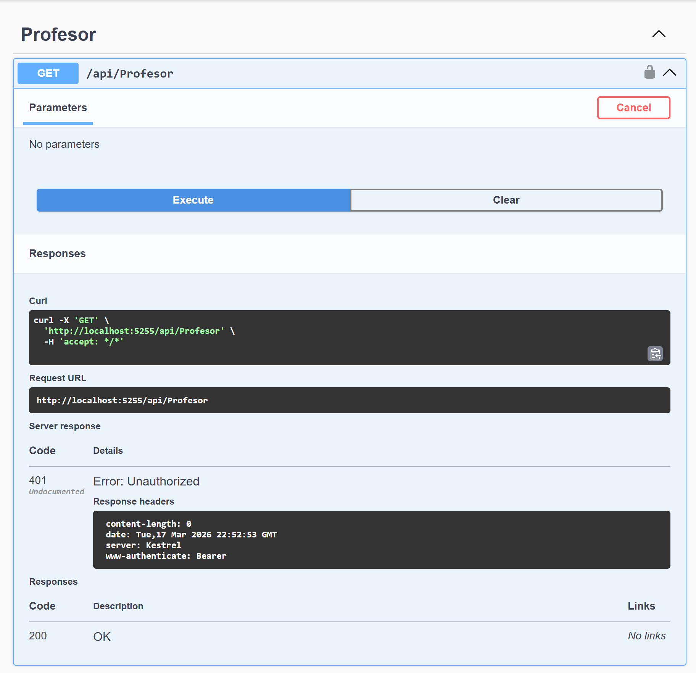
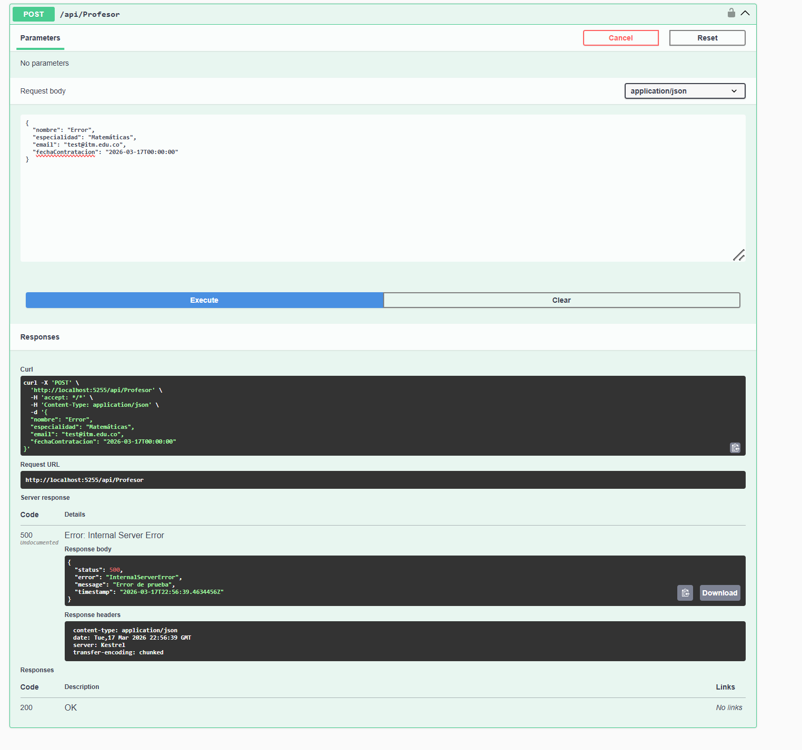

# GestionITM — Taller 02: Módulo de Gestión de Profesores

**Asignatura:** Programación de Software (580304006-9)
**Estudiante:** Thomas Reyes
**Rama:** `feature/modulo-profesores`
**Arquitectura:** Clean Architecture — N-Capas

---

## Estructura del Proyecto

```
GestionITM/
├── GestionITM.Domain/          ← Entidades, Interfaces, DTOs
├── GestionITM.Infrastructure/  ← Repositorios, Servicios, DbContext, Migraciones
└── GestionITM.API/             ← Controladores, Middleware, Mappings, Program.cs
```

---

## Evidencias

### 1. Tabla creada en SQL Server



---

### 2. Swagger bloqueando con [Authorize] — 401 Unauthorized



---

### 3. Middleware capturando el error — 500 Internal Server Error



---

## Indicadores Nivel 5 cumplidos

| Criterio | Implementación |
|----------|----------------|
| Inyección de Dependencias | `ProfesorController` inyecta `IProfesorService`, no el repositorio |
| Registro en `Program.cs` | `builder.Services.AddScoped<IProfesorService, ProfesorService>()` |
| AutoMapper | Mapeo automático sin asignaciones manuales |
| Asincronismo | `async/await` en todas las capas |
| Bonus — Email único | `ExisteEmailAsync()` valida duplicados antes de insertar |
